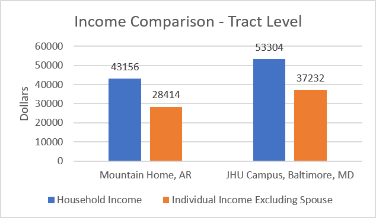
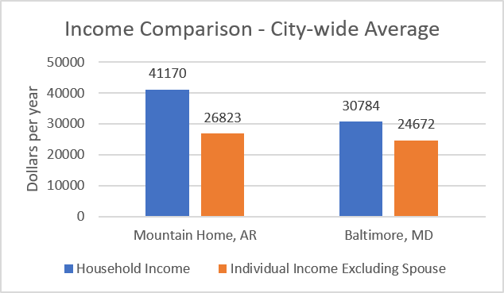
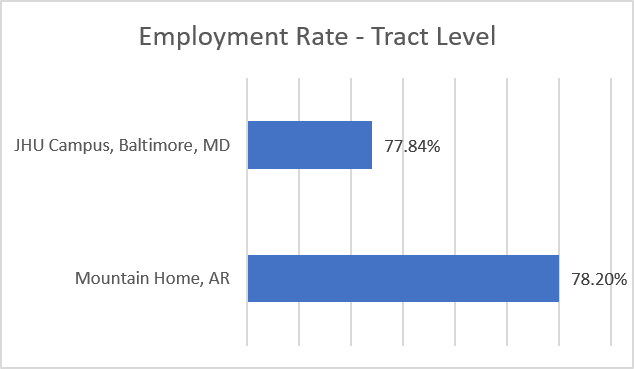
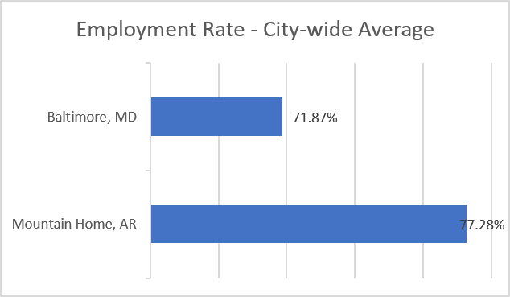

The data between Mountain Home, Arkansas and Baltimore, Maryland clearly shows a statistical difference between employment, household income, and income excluding spouses for children who grew up in these areas. Firstly, Tract 05005950300 was taken for my hometown as it was the tract I live in, and Tract 24510120202 was taken for Baltimore as it is where I currently live. However, I later organized all tracts in Baltimore and Mountain Home and averaged the data for each. 
  
Regarding the tracts, Baltimore has a much better average household income with a $10,148 increase over Mountain Home. In addition, Baltimore’s average individual income (excluding spouses) is also much higher with a $8,818 increase over Mountain Home. However, unlike the large statistical difference of income, the employment rate only differs by 0.36% with Mountain Home slightly ahead.
  
However, the statistical discrepancy between the tracts and the average data for each city paints an entirely different picture. The household income difference is nearly the same $10,386; however, Mountain Home is now ahead of Baltimore. Yet, the individual income does not differ much anymore, but the employment rate for Mountain Home is now 5.41% greater.
  
Altogether, these statistics show that around Johns Hopkins University, Baltimore is a greater place to live with higher income overall with a statistically insignificant difference of employment. However, when the entire cities are considered, Mountain Home is drastically better with greater income overall and higher employment.

Visual Graphs:

